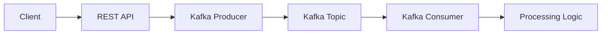

# Go-Kafka Comment Service

A production-ready comment processing system built with Go and Apache Kafka, demonstrating real-time event streaming and microservices architecture.


## 📚 Overview

This project showcases:
- Real-time comment processing using Kafka
- RESTful API with Fiber framework
- Event-driven architecture
- Containerized development environment
- Graceful shutdown handling
- Production-ready error handling

## 🏗️ Architecture

### System Components



### Data Flow
1. Client submits comment via REST API
2. Producer validates and publishes to Kafka
3. Consumer processes messages asynchronously
4. System maintains message ordering within partitions

## 🚀 Features

- **REST API**
  - Input validation
  - Error handling
  - JSON responses
  - API versioning

- **Kafka Integration**
  - Asynchronous processing
  - Guaranteed message delivery
  - At-least-once semantics
  - Partition support

- **Error Handling**
  - Graceful shutdown
  - Request validation
  - Detailed error responses
  - Comprehensive logging

## 🛠️ Technical Stack

| Component | Technology | Purpose |
|-----------|------------|---------|
| API Server | Fiber v2.52.1 | Fast HTTP server |
| Message Broker | Kafka | Event streaming |
| Client Library | Sarama v1.38.1 | Kafka integration |
| Container | Docker | Development environment |

## 📦 Installation

### Prerequisites
```bash
# Check Go version
go version  # Should be 1.22.6+

# Check Docker version
docker --version
docker-compose --version
```

### Setup Steps

1. **Clone Repository**
```bash
git clone https://github.com/yourusername/go-kafka.git
cd go-kafka
```

2. **Start Kafka**
```bash
docker-compose up -d
```

3. **Install Dependencies**
```bash
go mod tidy
```

4. **Start Services**
```bash
# Terminal 1 - Producer
cd producer
go run producer.go

# Terminal 2 - Consumer
cd worker
go run worker.go
```

## 📝 API Documentation

### Create Comment
```http
POST /api/v1/comments
Content-Type: application/json

{
    "text": "Your comment text here"
}
```

#### Success Response
```json
{
    "success": true,
    "message": "Comment pushed successfully",
    "comment": {
        "text": "Your comment text here"
    }
}
```

#### Error Responses
```json
// 400 Bad Request
{
    "success": false,
    "message": "Invalid request body",
    "error": "error details"
}

// 500 Internal Server Error
{
    "success": false,
    "message": "Failed to queue comment"
}
```

## 🔍 Testing

```bash
# Test API
curl -X POST http://localhost:3000/api/v1/comments \
  -H "Content-Type: application/json" \
  -d '{"text":"Hello, World!"}'

# Monitor Kafka Topics
docker exec -it kafka kafka-topics.sh --bootstrap-server localhost:9092 --list
docker exec -it kafka kafka-console-consumer.sh --bootstrap-server localhost:9092 --topic comments --from-beginning
```

## 📊 Monitoring

### Kafka Health Check
```bash
# List topics
docker exec -it kafka kafka-topics.sh --bootstrap-server localhost:9092 --list

# Check consumer groups
docker exec -it kafka kafka-consumer-groups.sh --bootstrap-server localhost:9092 --list
```

## 🔧 Configuration

### Producer Settings
- Max Retries: 5
- Required Acks: WaitForAll
- Success Tracking: Enabled

### Consumer Settings
- Error Reporting: Enabled
- Offset: Oldest
- Partition: 0

## 🤝 Contributing

1. Fork repository
2. Create feature branch
3. Commit changes
4. Push to branch
5. Open pull request

## 📄 License

MIT License - See [LICENSE](LICENSE) for details

## 📬 Contact

- Author: Your Name
- Email: your.email@example.com
- GitHub: [@yourusername](https://github.com/yourusername)
